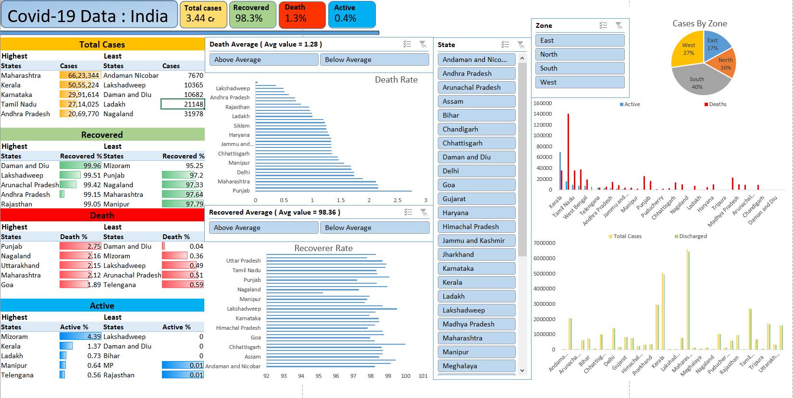

# This dataset has Covid-19 report of Indian state. The data is divided into state wise data with ,
1. Total Cases
2. Active Cases
3. Discharged
4. Deaths and,
5. Population 

# Introduction
An interactive Dashboard is made on the Indian Covid-19 state wise data in Excel and analysis was made on the data to get to the results and the impact of Covid-19 on different states of India. This Data was taken from Kaggle. To improve the analysis few tables were added.

## Tools used to analyze the data
1. This analysis was done with the help of **Excel** since the DataSet was small which in turn was an advantage since **Excel** is faster for   small DataSets.
2. To be precise in the results I used **Pivot Tables** which helped me to summarize, sort, group, count or sum the data in table.
3. **Slicers** were used to retrieve the data of the required segment of analysis.
4. **Conditional formatting** was used to highlight the data of necessary felids in the outcomes.

## Additional work 
1. TO know the deeper intuition of the data a new column was added called **Zone** to know the consolidated effects of the states at Region level.
2. To know the stand alone result of the state with respect to the impact of Covid-19 **Active ratio**, **Death Ratio**, **Discharge Ratio** was found out by, 
- Active ratio = (Active cases / Total cases) * 100
- Death ratio = (Deaths / Total cases) * 100
- Discharge ratio = (Discharged / Total case) * 100
These made a little easy to draw the outcomes of the analysis.

## Question for the analysis 
1. What is the trend of as per the data ?
2. Which part of India is more affected ?
3. What could be the cause for the rise in Covid-19 case ?
4. Which State/ States is more prone to Covid-19 ?
5. Any factors that could affect the cases ?

## SUMMARY and Conclusion

1. Since India is very highly populated country, the impact of Covid-19 on India was also huge since Covid-19 was a infectious disease caused by virus.
2. The total number of cases recorder was mammoth number of 3.44 Cr according to the data, in which 98.3% of the infected people recovered, 0.4% of cases are still active and 1.3% were the casualties of this virus.
3. As per the insight of the data India is having quiet moderate recovering condition with fear in the active cases still present.
4. As per the analysis **South** zone is more affected during the pandemic in which Kerala, TamilNadu and Karnataka are the major contributors.
5. According to the data Maharashtra, Kerala, Karnataka, Tamilnadu recorded more number os cases compared to its peers and Punjab, Nagaland, Uttarakand and Maharashtra has more death percentage. 
6. Population could be the major reason for the increase in the Covid-19 cases as states with more population are more prone to the cases or deaths and states with minimal population are less prone to cases and casualties.

## Outlook of the interactive Dashboard

=======